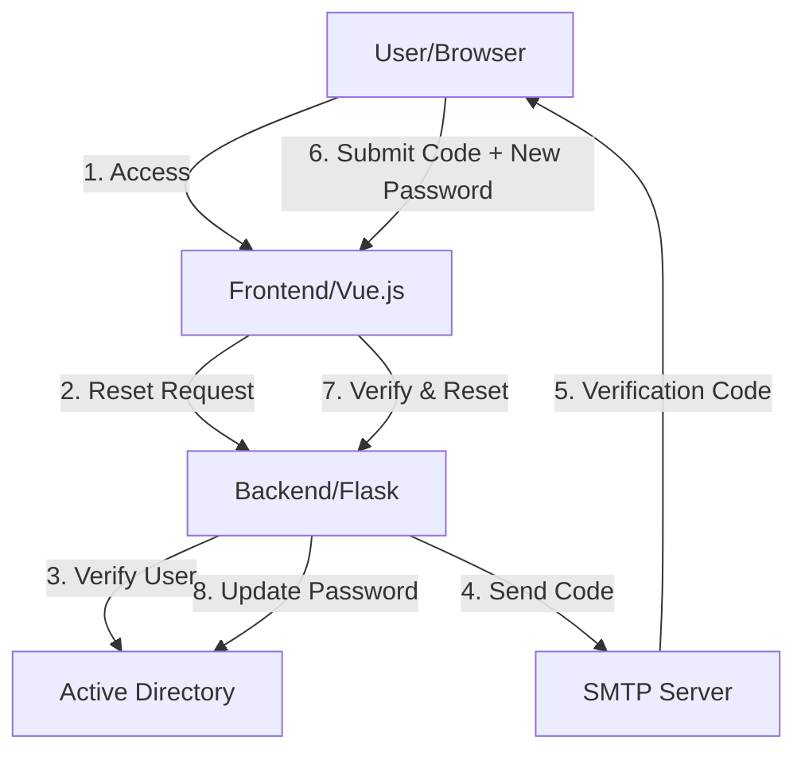

# AD-Reset

A Flask-based Active Directory password reset tool that supports password reset via email verification code.

[中文文档](README_CN.md) | English

## Features

- Password reset via email verification code
- Support for multiple username formats (username, email, UPN, etc.)
- Password complexity validation
- Detailed logging
- SSL/TLS encryption support
- Multi-language support (English/Chinese)

## Project URL

[https://github.com/Jas0nxlee/AD-Reset](https://github.com/Jas0nxlee/AD-Reset)

## System Requirements

- Python 3.8+
- Active Directory server
- SMTP mail server

## Installation

### Method 1: Traditional Installation

1. Clone the repository:
```bash
git clone https://github.com/Jas0nxlee/AD-Reset.git
cd AD-Reset
```

2. Install dependencies:
```bash
pip install -r requirements.txt
```

3. Configure environment variables:
Create a `.env` file and set the following variables:
```env
# LDAP Configuration
LDAP_SERVER=your_ldap_server
LDAP_PORT=636
LDAP_BASE_DN=your_base_dn
LDAP_USER_DN=your_user_dn
LDAP_USER=your_admin_user
LDAP_DOMAIN=your_domain
LDAP_PASSWORD=your_password

# SMTP Configuration
SMTP_SERVER=your_smtp_server
SMTP_PORT=587
SMTP_USERNAME=your_smtp_username
SMTP_PASSWORD=your_smtp_password

# Server Configuration
SERVER_IP=0.0.0.0
PORT=5001
```

### Method 2: Docker Compose Installation

1. Clone the repository:
```bash
git clone https://github.com/Jas0nxlee/AD-Reset.git
cd AD-Reset
```

2. Create a `.env` file with your configuration (as shown above in the Traditional Installation section)

3. Create a `docker-compose.yml` file:
```yaml
version: '3.8'
services:
  backend:
    build: 
      context: ./backend
      dockerfile: Dockerfile
    ports:
      - "5001:5001"
    env_file:
      - .env
    volumes:
      - ./logs:/app/logs

  frontend:
    build:
      context: ./frontend
      dockerfile: Dockerfile
    ports:
      - "5173:80"
    depends_on:
      - backend

networks:
  default:
    driver: bridge
```

4. Start the services:
```bash
docker-compose up -d
```

5. Access the application:
Open your browser and visit `http://localhost:5173`

## Usage

1. Start the backend service:
```bash
python backend/app.py
```

2. Start the frontend service:
```bash
cd frontend
npm install
npm run dev
```

3. Access the application:
Open your browser and visit `http://localhost:5173`

## Password Policy

Passwords must meet the following requirements:
- Minimum length of 8 characters
- At least one uppercase letter
- At least one lowercase letter
- At least one number
- At least one special character
- Cannot contain username
- Cannot contain consecutive repeated characters
- Cannot contain keyboard sequences or consecutive number sequences
- Cannot contain repeated character patterns
- Cannot contain common words or organization names

## Logging

Log files are stored in the `logs` directory and include:
- User operation records
- Error messages
- System status
- Security events

## Security Features

- SSL/TLS encrypted communication
- Encrypted password transmission
- Verification code expiration
- Detailed error handling and logging
- Protection against brute force attacks

## Contributing

Issues and Pull Requests are welcome to help improve the project.

## License

MIT License

Copyright (c) 2025 Jas0nxlee

Permission is hereby granted, free of charge, to any person obtaining a copy
of this software and associated documentation files (the "Software"), to deal
in the Software without restriction, including without limitation the rights
to use, copy, modify, merge, publish, distribute, sublicense, and/or sell
copies of the Software, and to permit persons to whom the Software is
furnished to do so, subject to the following conditions:

The above copyright notice and this permission notice shall be included in all
copies or substantial portions of the Software.

THE SOFTWARE IS PROVIDED "AS IS", WITHOUT WARRANTY OF ANY KIND, EXPRESS OR
IMPLIED, INCLUDING BUT NOT LIMITED TO THE WARRANTIES OF MERCHANTABILITY,
FITNESS FOR A PARTICULAR PURPOSE AND NONINFRINGEMENT. IN NO EVENT SHALL THE
AUTHORS OR COPYRIGHT HOLDERS BE LIABLE FOR ANY CLAIM, DAMAGES OR OTHER
LIABILITY, WHETHER IN AN ACTION OF CONTRACT, TORT OR OTHERWISE, ARISING FROM,
OUT OF OR IN CONNECTION WITH THE SOFTWARE OR THE USE OR OTHER DEALINGS IN THE
SOFTWARE.

## System Architecture

### Architecture Diagram


### Information Flow
1. User accesses the password reset interface
2. Frontend sends password reset request to backend
3. Backend verifies user existence in AD
4. System sends verification code via email
5. User receives verification code
6. User submits verification code and new password
7. Backend validates the code and password requirements
8. System updates password in Active Directory

### Component Description
- **Frontend**: Vue.js based web interface
- **Backend**: Flask API server
- **Active Directory**: User authentication and management
- **SMTP Server**: Email service for verification codes
- **Database**: Redis for verification code storage 