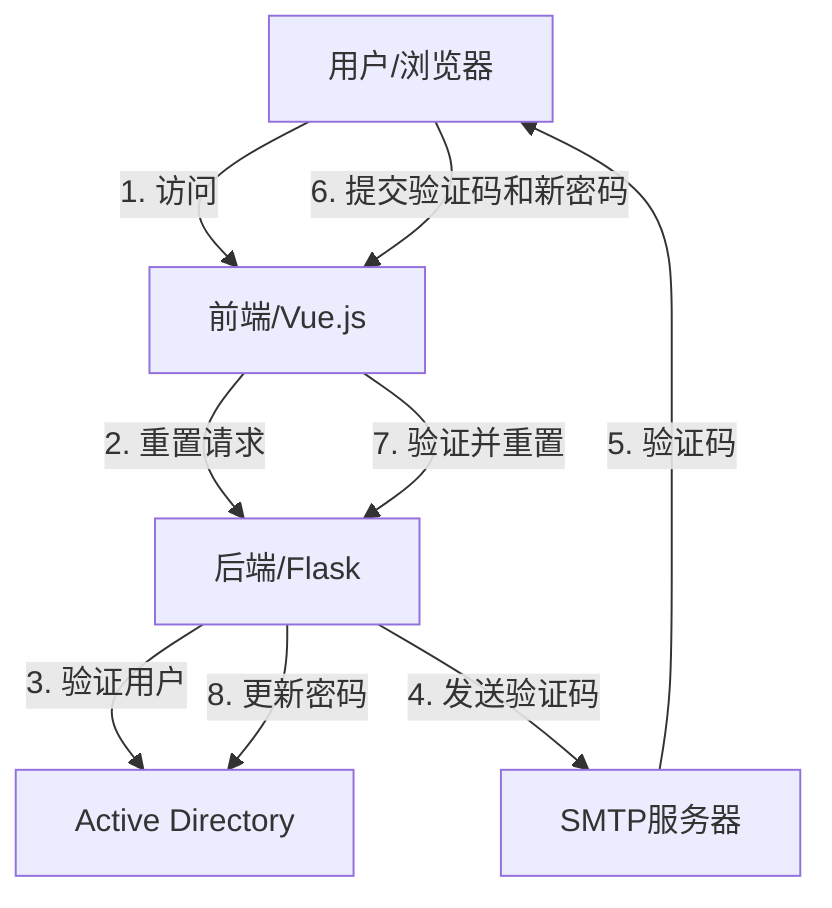

# AD-Reset

一个基于 Flask 的 Active Directory 密码重置工具，支持通过邮件验证码重置密码。

[English](README.md) | 中文文档

## 功能特点

- 支持通过邮件验证码重置 AD 密码
- 支持多种用户名格式（用户名、邮箱、UPN等）
- 密码复杂度验证
- 详细的日志记录
- 支持 SSL/TLS 加密
- 支持多语言（中文/英文）

## 项目地址

[https://github.com/Jas0nxlee/AD-Reset](https://github.com/Jas0nxlee/AD-Reset)

## 系统要求

- Python 3.8+
- Active Directory 服务器
- SMTP 邮件服务器

## 安装方法

### 方法一：传统安装

1. 克隆项目：
```bash
git clone https://github.com/Jas0nxlee/AD-Reset.git
cd AD-Reset
```

2. 安装依赖：
```bash
pip install -r requirements.txt
```

3. 配置环境变量：
创建 `.env` 文件并设置以下变量：
```env
# LDAP配置
LDAP_SERVER=your_ldap_server
LDAP_PORT=636
LDAP_BASE_DN=your_base_dn
LDAP_USER_DN=your_user_dn
LDAP_USER=your_admin_user
LDAP_DOMAIN=your_domain
LDAP_PASSWORD=your_password

# SMTP配置
SMTP_SERVER=your_smtp_server
SMTP_PORT=587
SMTP_USERNAME=your_smtp_username
SMTP_PASSWORD=your_smtp_password

# 服务器配置
SERVER_IP=0.0.0.0
PORT=5001
```

### 方法二：Docker Compose 安装

1. 克隆仓库：
```bash
git clone https://github.com/Jas0nxlee/AD-Reset.git
cd AD-Reset
```

2. 创建 `.env` 配置文件（参考上述传统安装部分的配置示例）

3. 创建 `docker-compose.yml` 文件：
```yaml
version: '3.8'
services:
  backend:
    build: 
      context: ./backend
      dockerfile: Dockerfile
    ports:
      - "5001:5001"
    env_file:
      - .env
    volumes:
      - ./logs:/app/logs

  frontend:
    build:
      context: ./frontend
      dockerfile: Dockerfile
    ports:
      - "5173:80"
    depends_on:
      - backend

networks:
  default:
    driver: bridge
```

4. 启动服务：
```bash
docker-compose up -d
```

5. 访问应用：
在浏览器中访问 `http://localhost:5173`

## 使用方法

1. 启动后端服务：
```bash
python backend/app.py
```

2. 启动前端服务：
```bash
cd frontend
npm install
npm run dev
```

3. 访问应用：
打开浏览器访问 `http://localhost:5173`

## 密码策略

密码必须满足以下要求：
- 长度至少为8个字符
- 包含至少一个大写字母
- 包含至少一个小写字母
- 包含至少一个数字
- 包含至少一个特殊字符
- 不能包含用户名
- 不能包含连续重复的字符
- 不能包含键盘序列或连续的数字序列
- 不能包含重复的字符模式
- 不能包含常见单词或组织名称

## 日志记录

日志文件保存在 `logs` 目录下，包含以下信息：
- 用户操作记录
- 错误信息
- 系统状态
- 安全事件

## 安全特性

- 使用 SSL/TLS 加密通信
- 密码传输加密
- 验证码有效期限制
- 详细的错误处理和日志记录
- 防止暴力破解

## 贡献指南

欢迎提交 Issue 和 Pull Request 来帮助改进项目。

## 许可证

MIT License

Copyright (c) 2025 Jas0nxlee

特此授权，任何获得本软件和相关文档（以下简称"软件"）副本的人都可以免费使用本软件，包括但不限于使用、复制、修改、合并、出版、发行、再授权、销售软件的副本，以及允许获得本软件的人这样做，但须遵守以下条件：

在所有副本或重要部分的软件中都必须包含上述版权声明和本许可声明。

本软件按"原样"提供，不提供任何形式的明示或暗示的保证，包括但不限于对适销性、特定用途的适用性和非侵权性的保证。在任何情况下，作者或版权持有人都不对任何索赔、损害或其他责任负责，无论这些责任是由合同、侵权或其他原因引起的，与软件或其使用或其他交易有关。

## 系统架构

### 架构图


### 信息流转
1. 用户访问密码重置界面
2. 前端向后端发送密码重置请求
3. 后端在AD中验证用户存在性
4. 系统通过邮件发送验证码
5. 用户接收验证码
6. 用户提交验证码和新密码
7. 后端验证代码和密码要求
8. 系统在Active Directory中更新密码

### 组件说明
- **前端**：基于Vue.js的Web界面
- **后端**：Flask API服务器
- **Active Directory**：用户认证和管理
- **SMTP服务器**：验证码邮件服务
- **数据库**：Redis用于验证码存储